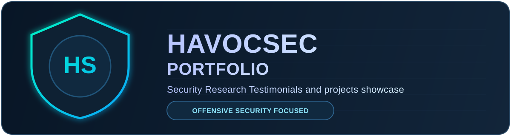

# 🔐 Daniel Wambua | Security Portfolio

A modern, cyberpunk-themed portfolio showcasing security research, CTF writeups, and open-source tools.

<p align="center">
  
</p>

<p align="center">
  
  
  
  
  
  
  
</p>

## ✨ Features

- **12 Cyberpunk Themes** - Neon Tokyo, Dark Amethyst, Matrix Green, Synthwave, and more
- **Dynamic Content** - Auto-fetches latest CTF writeups from [havocsec.dev](https://havocsec.dev) RSS feed
- **GitHub Integration** - Displays featured repositories with live stats
- **HackTheBox Badge** - Live HTB profile stats
- **Animated Particles** - Interactive particle.js background
- **Responsive Design** - Works on all devices
- **Fast Loading** - Optimized with caching headers for Vercel

## 🚀 Live Demo

- **Brief Portfolio**: [portfolio.havocx.me](https://portfolio.havocx.me)
- **Full Portfolio**: [danielwambua.dev](https://danielwambua.dev)

## 🛠️ Tech Stack

- HTML5 / CSS3 / Vanilla JavaScript
- Pure-CSS animated backdrop (no canvas, no JS render loop)
- RSS Feed integration for dynamic content
- GitHub API for repository stats
- Deployed on Vercel

## 📁 Project Structure

```
├── index.html          # Main HTML file
├── vercel.json         # Vercel deployment config
├── favicon.svg         # Custom cyberpunk favicon
├── css/
│   ├── style.css       # Main styles
│   ├── themes.css      # 12 color themes
│   └── animation.css   # Animations
├── js/
│   └── script.js       # Theme + nav toggle, RSS/GitHub fetch
└── images/
    ├── profile-*.webp  # Profile photo (webp, 1x/2x)
    ├── profile-*.jpg   # Profile photo fallback
    ├── guns-mask.webp  # guns.lol icon alpha mask
    └── project-logo.svg
```

## 🎨 Available Themes

| Theme | Icon | Vibe |
|-------|------|------|
| Neon Tokyo | 🌃 | Pink/Cyan cyberpunk |
| Dark Amethyst | 🔮 | Purple mystical |
| Midnight Forest | 🌲 | Green nature |
| Cyber Blood | 🩸 | Red aggressive |
| Arctic Frost | ❄️ | Ice blue |
| Golden Haze | ✨ | Warm amber |
| Void Purple | 🌌 | Deep space |
| Ocean Depths | 🌊 | Teal underwater |
| Sunset Ember | 🌅 | Orange coral |
| Matrix Green | 💻 | Hacker green |
| Synthwave | 🎧 | Retro magenta/cyan |
| Nord Aurora | 🌌 | Soft nordic blue |

## 🔧 Local Development

```bash
# Clone the repository
git clone https://github.com/Daniel-wambua/portfolio-new.git
cd portfolio-new

# Serve locally (Python)
python3 -m http.server 8080

# Or use any static server
npx serve .
```

## 🚀 Deploy to Vercel

[](https://vercel.com/new/clone?repository-url=https://github.com/Daniel-wambua/portfolio-new)

Or manually:
```bash
npm i -g vercel
vercel
```

## 📬 Contact
- **Blog**: [havocsec.dev](https://havocsec.dev)
- **GitHub**: [@Daniel-wambua](https://github.com/Daniel-wambua)
- **HackTheBox**: [Profile](https://app.hackthebox.com/profile/2081158)

---

<details>
<summary><strong>📄 License (Click to expand)</strong></summary>

### MIT License

Copyright (c) 2026 Daniel Wambua

Permission is hereby granted, free of charge, to any person obtaining a copy
of this software and associated documentation files (the "Software"), to deal
in the Software without restriction, including without limitation the rights
to use, copy, modify, merge, publish, distribute, sublicense, and/or sell
copies of the Software, and to permit persons to whom the Software is
furnished to do so, subject to the following conditions:

The above copyright notice and this permission notice shall be included in all
copies or substantial portions of the Software.

THE SOFTWARE IS PROVIDED "AS IS", WITHOUT WARRANTY OF ANY KIND, EXPRESS OR
IMPLIED, INCLUDING BUT NOT LIMITED TO THE WARRANTIES OF MERCHANTABILITY,
FITNESS FOR A PARTICULAR PURPOSE AND NONINFRINGEMENT. IN NO EVENT SHALL THE
AUTHORS OR COPYRIGHT HOLDERS BE LIABLE FOR ANY CLAIM, DAMAGES OR OTHER
LIABILITY, WHETHER IN AN ACTION OF CONTRACT, TORT OR OTHERWISE, ARISING FROM,
OUT OF OR IN CONNECTION WITH THE SOFTWARE OR THE USE OR OTHER DEALINGS IN THE
SOFTWARE.

</details>

---

<p align="center">
  <sub>Built with 💜 by <a href="https://guns/lol/0xhavoc">Daniel Wambua</a></sub>
</p>
